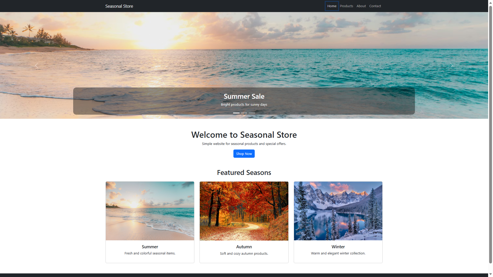
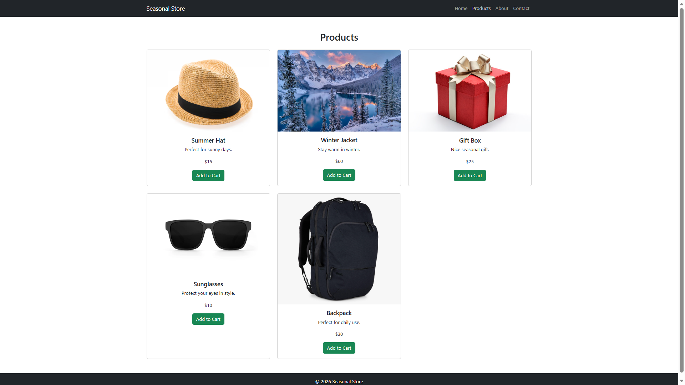
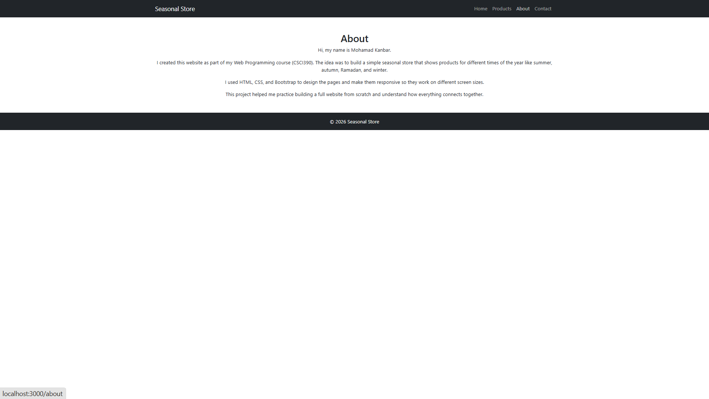
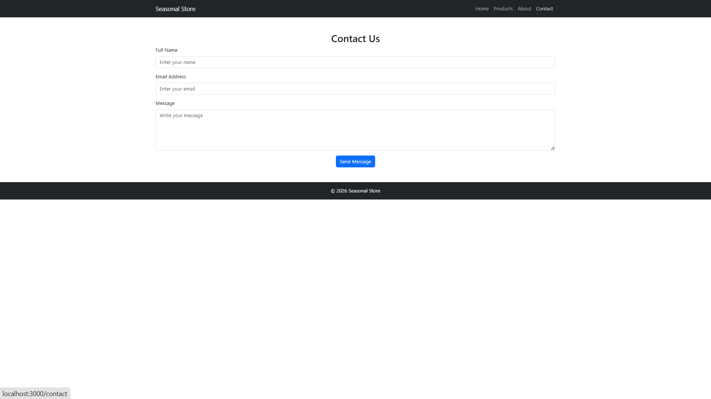

# Seasonal Store

## Project Description
Seasonal Store is a frontend web application developed using ReactJS and Bootstrap for the CSCI390 Web Programming course.

The website displays seasonal products and collections for different times of the year such as Summer, Autumn, and Winter.

The project includes multiple pages, responsive design, navigation using React Router, and product sections.

---

## Technologies Used
- ReactJS
- Bootstrap 5
- HTML
- CSS
- JavaScript

---

## Pages
- Home
- Products
- About
- Contact

---

## Features
- Responsive design
- Product cards
- Image carousel
- Navigation bar
- React Router navigation
- Bootstrap styling

---

## Setup Instructions

1. Open terminal inside the project folder

2. Install dependencies

```bash
npm install
```

3. Start the project

```bash
npm start
```

4. Open in browser

http://localhost:3000

---

## Author
Mohamad Kanbar

---

## Screenshots

### Home Page


### Products Page


### About Page


### Contact Page
